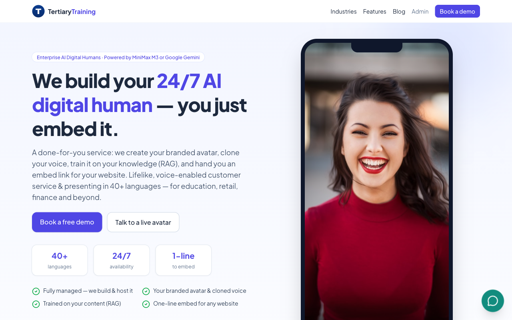

# Tertiary Training — AI Digital Human Service

A marketing site **and** platform for a done-for-you **AI digital-human service**: we build a client's branded, voice-enabled avatar, clone their voice, train it on their content (RAG), and hand them a one-line **embed** for any website. Visitors talk to the avatar by **voice or text** and it answers out loud — 24/7, in 40+ languages — for customer service, sales and presenting across education, retail, finance, healthcare and more.

🔗 **Live:** https://www.tertiarytraining.com



## Stack

- **Next.js 16** (App Router) · React 19 · TypeScript · Tailwind v4 · Plus Jakarta Sans · Lucide icons
- **PostgreSQL** + **Prisma**
- **Auth.js (NextAuth v5)** — credentials, role-based (`USER` / `ADMIN`)
- **LLM (swappable):** **MiniMax M3** *or* **Google Gemini** (admin-selectable, OpenAI-compatible)
- **Voice:** **MiniMax Speech 2.8 Turbo** (TTS + voice cloning)
- **Lip-sync:** **inference.sh** (OmniHuman / Fabric) behind a swappable `AvatarRenderer`
- Email via SMTP (lead notifications); S3-compatible storage (optional) with local-disk fallback

## Features

- **Agentic voice chat** — `/api/chat` streams an SSE agent loop: ground on knowledge → M3/Gemini tool-calling (`lookup_course`, `book_consultation`, `escalate_to_human`) → TTS → lip-sync clip. Voice/video degrade gracefully to a browser voice + talking animation.
- **Avatar studio** — create an avatar from a photo / webcam / short video, clone a voice, pick voice + language, add knowledge (RAG).
- **Embeddable widget** — `public/embed.js` drops a floating avatar chat onto any site via a per-avatar embed key.
- **Lead capture** — "Request a Digital Human demo" form (validation + honeypot) → stored to `/admin/leads`, emails the team + acknowledges the enquirer.
- **Blog + CMS** — editable Pages (About/Contact/Privacy/Terms) and Blog posts (each a lead magnet) managed in `/admin`.
- **WhatsApp** floating widget, marketing one-pager (industries, capabilities, service steps), SEO metadata + Organization JSON-LD.
- **Hardened** — per-IP rate limits on public endpoints, zod input caps, encrypted admin-managed API keys.

## Architecture

```
Browser (mic/cam) ──STT──▶ /api/chat (SSE) ──▶ agentic loop ──▶ MiniMax M3 / Gemini (tool-calling)
      ▲                                              │
      │  text + audio + video clip                   ├─▶ MiniMax Speech 2.8 (TTS / voice clone)
      └──────────────────────────────────────────────┴─▶ Avatar renderer (inference.sh)
```

## Local development

```bash
cp .env.example .env          # fill NEXTAUTH_SECRET + ENCRYPTION_KEY (openssl rand -base64 32)
docker compose up -d postgres # local Postgres on :5432
npm install
npx prisma migrate dev        # create schema
npm run dev                   # http://localhost:3000
```

The **first account you register becomes ADMIN**. In **/admin/settings** choose the AI provider and enter the keys (MiniMax key + Group ID, and/or Gemini key; optional inference.sh token + SMTP). Then create an avatar at **/admin/avatars/new** and grab its embed snippet. Manage **Leads**, **Blog** and **Pages** from the admin nav.

## Embedding on any website

```html
<script src="https://www.tertiarytraining.com/embed.js" data-avatar="EMBED_KEY" async></script>
```

Optional: `data-color="#4f46e5"`, `data-position="left|right"`. The embed key is on each avatar's admin page.

## Deploy (Coolify)

Builds the multi-stage `Dockerfile` (Next.js standalone). `docker-entrypoint.sh` runs `prisma migrate deploy` then starts the server; CMS pages + sample blog posts lazy-seed on first visit. Auto-deploys on push via a GitHub → Coolify webhook.

Required env: `DATABASE_URL`, `NEXTAUTH_URL`, `NEXTAUTH_SECRET`, `ENCRYPTION_KEY`. Optional: `MINIMAX_*` / `GEMINI_*`, `INFERENCE_SH_TOKEN`, `SMTP_*`, `S3_*` (all also settable in `/admin/settings`). Secrets are per-environment — re-enter the AI key in the deployed `/admin/settings` after first deploy.

> **Note:** this server fronts apps with a shared Traefik (entrypoints `web`/`websecure`, resolver `mytlschallenge`); the app's Coolify container labels are set to match. Lip-sync is turn-based and needs publicly reachable media (works deployed, not on localhost).

## Project layout

- `src/lib/minimax/` — M3/Gemini chat + Speech 2.8 TTS/voice-clone clients
- `src/lib/agent/` — agentic orchestrator, tools, knowledge retrieval
- `src/lib/cms.ts` — editable Pages + Blog content (+ lazy seed)
- `src/lib/avatar/renderer.ts` — swappable lip-sync renderer
- `src/app/admin/` — settings, avatar studio, leads, blog, pages (auth-guarded)
- `src/components/` — `ChatWidget`, `LeadForm`, `WhatsAppWidget`, `SiteFooter`, `PageFrame`
- `public/embed.js` — embeddable widget loader
